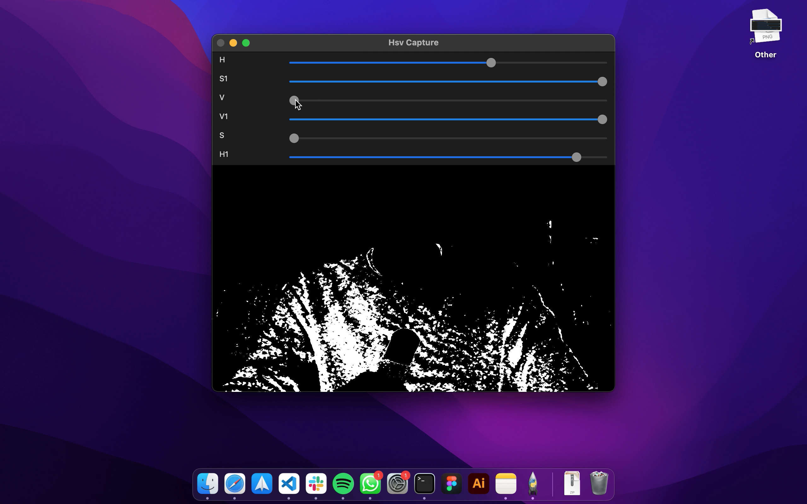
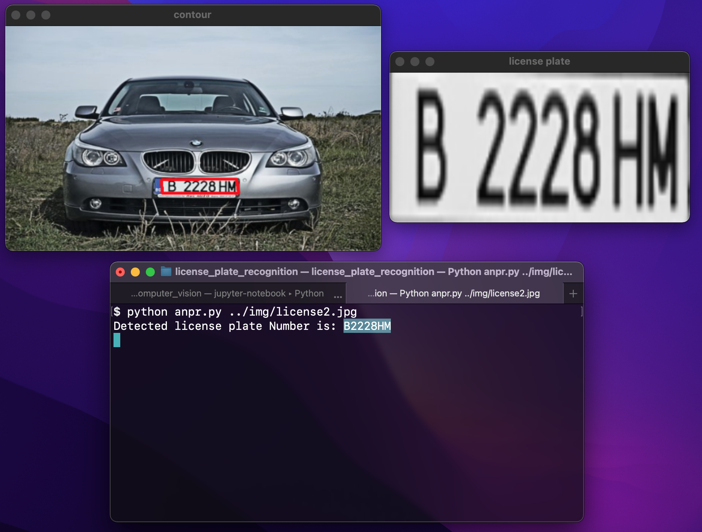

# Computer Vision

A sandbox where I develop tools and learn methods of computer vision

## Text recognition

As a personal tool, I implemented text recognition on images embedded in the Mac operating system, such that I can extract text from any images in a few clicks.
The optical character recognition is developed using Python OpenCV and Tesseract OCR. The preprocessing is quite simple in order to keep it generic, it is composed of transforming the image into grey scale and thresholding intensity. The pipeline automatically detects and handles rotation as shown in the example below.

To be able to access this tool through a menu, I created an Automator workflow that is available under `text_recognition_action.workflow`. Copying this folder to `~/Library/Services` or `Users/<your user account>/Library/Services` should be sufficient to have this workflow available in the Quick Actions menu when right clicking on an image.
To use it yourself first create a virtual environment called `venv` and install packages in `requirements.txt`. Then in the automator script, modify the first line to a static path pointing at the `text_recognition`. The resulting image and text files are stored in `text_recognition/results` respectively as `image.png` and `ocr.txt` and are replaced at each use of the action.

## Air Canvas

The goal of this project is to augment reality by drawing in the air. The process works in two steps: the first to choose a pointer and find an adequate HSV range. This is illustrated in the first example thanks to dynamic HSV range tuners. And in a second, using the pointer's color range and dilation, the program detects the pointer and draw a line linking the successive positions. All the process is implemented using OpenCV and NumPy.

## Automatic Number Plate recognition

This project builds on top of the first one, text recognition, by trying to read the license plate from a car within an image. The pipeline first finds potential license plate by successively converting to grayscale, applying a bilateral and canny filters and finally finding the contours. We choose the first 4-edge contour. We then apply a mask of this contour to the original image to extract the license plate and apply Optical Character Recognition using Tesseract. The output text is cleaned using regex to keep only alphanumeric characters.

## Colorful Image Colorization

This is a playground for coloring grayscale images using the pre-trained model of Zhang et al.

## Futur ideas

* Road lane detection
* Vehicle counting
* Image deblurring through GAN
* Transform images into painter's style with CycleGAN

